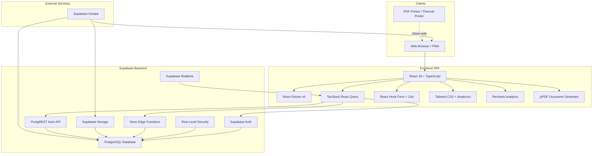
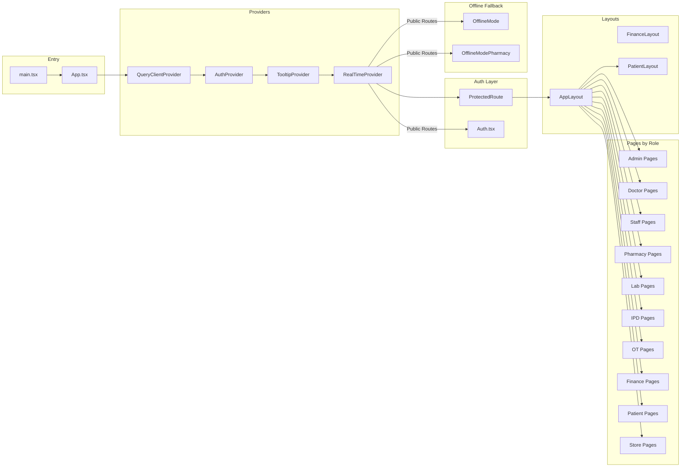
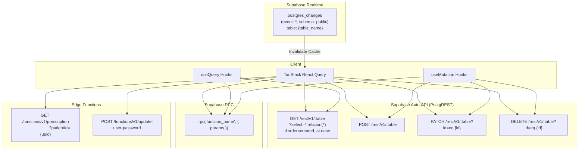
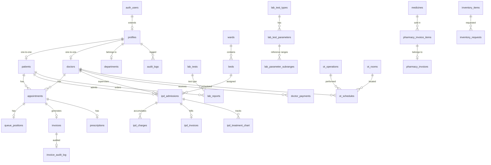
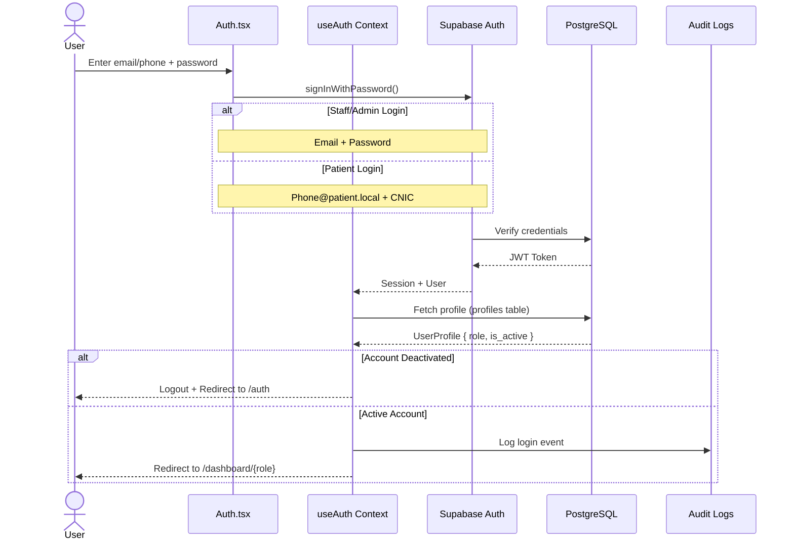
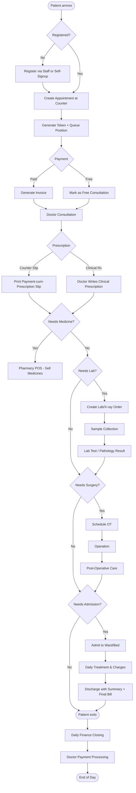
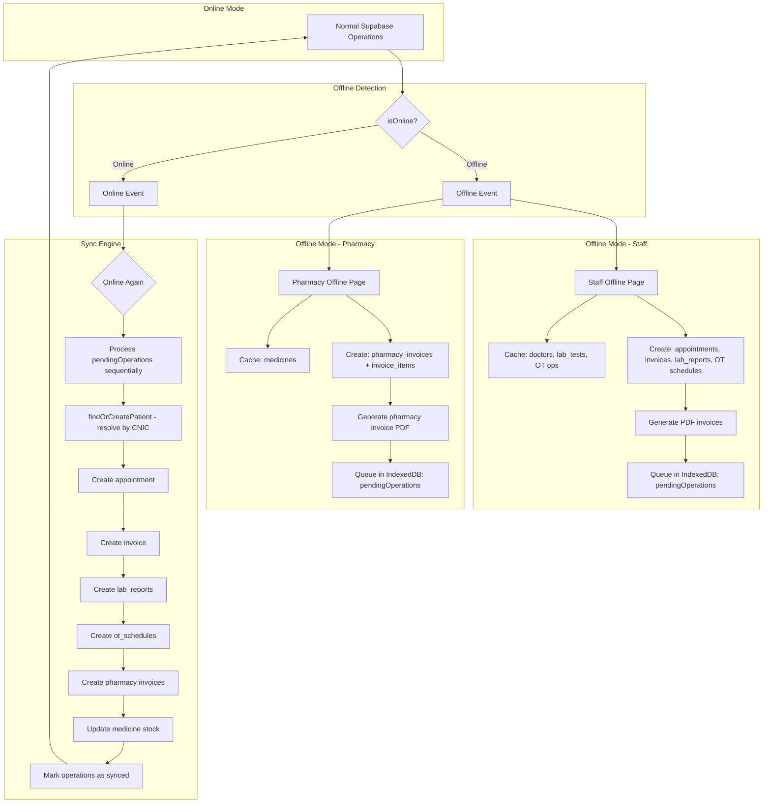
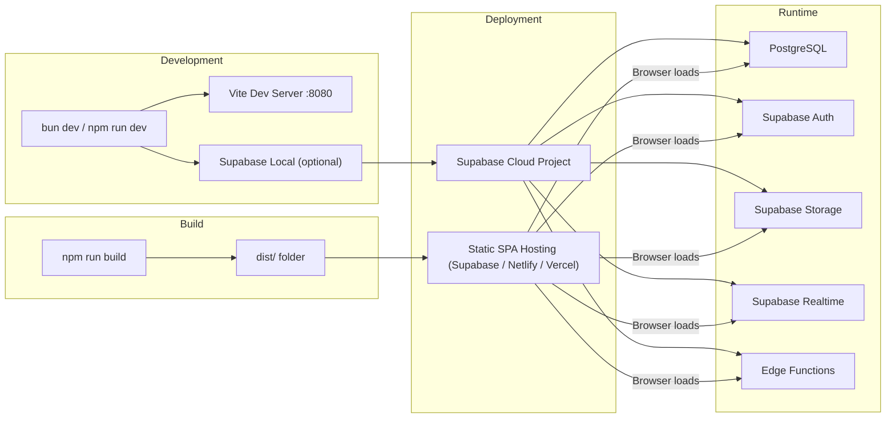

<div align="center">

# 🏥 Southwest Hospital Kohat — HIMS

### Hospital Information Management System ("Health Nexus")

A complete, role-based Hospital Information Management System covering the full patient journey — reception, OPD, pharmacy, laboratory & pathology, radiology, operation theatre, in-patient department (IPD), finance, payroll, inventory, and administration — built as a single-page web application on **React + TypeScript + Vite** with a **Supabase** (PostgreSQL) backend.

<br/>


</div>

---

> **Repository status:** Private / proprietary, under **active development**. Package version `0.0.0` (`private: true`). This README is the authoritative technical documentation, generated from a full source-tree audit of the actual code, database migrations, and configuration. Every claim below was verified against repository files; anything that could not be determined is explicitly marked **"Not detected during repository analysis."**

---

## 📑 Table of Contents

1. [Overview](#-overview)
2. [Features](#-features)
3. [Screenshots](#-screenshots)
4. [Technology Stack](#-technology-stack)
5. [Architecture](#-architecture)
6. [Folder Structure](#-folder-structure)
7. [Installation](#-installation)
8. [Environment Variables](#-environment-variables)
9. [Database](#-database)
10. [API Documentation](#-api-documentation)
11. [Web Application](#-web-application)
12. [Authentication & Authorization](#-authentication--authorization)
13. [Security](#-security)
14. [Performance](#-performance)
15. [Offline Support](#-offline-support)
16. [Error Handling](#-error-handling)
17. [Logging](#-logging)
18. [Testing](#-testing)
19. [Deployment](#-deployment)
20. [Roadmap](#-roadmap)
21. [Troubleshooting](#-troubleshooting)
22. [FAQ](#-faq)
23. [Contributing](#-contributing)
24. [License](#-license)
25. [Authors](#-authors)
26. [Acknowledgements](#-acknowledgements)

---

## 🔭 Overview

### What This Project Is

**Southwest Hospital Kohat HIMS** is a browser-based hospital management platform that digitizes the day-to-day operations of a mid-sized private hospital in **Kohat, Pakistan**. It is a **single-page application (SPA)** served to a wide variety of internal users — reception/front-desk staff, doctors, pharmacists, lab technicians, OT assistants, nursing & IPD staff, store/inventory managers, finance officers, and administrators — as well as a **patient self-service portal**.

The system is internally branded **"Health Nexus"** (PWA manifest / `index.html`) and runs entirely against a **Supabase** project (`drvehnnspspwcbkmtccy`) using PostgreSQL with Row-Level Security, the PostgREST auto-API, Realtime, Storage, Auth, and two Deno Edge Functions. There is **no custom application server** — the database *is* the backend.

### Why It Exists / The Business Problem It Solves

A hospital generates revenue and clinical records across many disconnected silos — the consultation counter, the pharmacy, the lab, radiology, the operating theatre, the wards, and the finance office. This HIMS unifies them into one auditable system so that:

- A **patient's journey** (registration → appointment/token → consultation → prescription → lab/X-ray → pharmacy → admission/surgery → discharge → billing) is captured end-to-end.
- **Every rupee** is traced from its source department to the **daily cash closing** and **monthly reconciliation** (see [`HIMS_Financial_Flow_Guide.md`](HIMS_Financial_Flow_Guide.md)).
- **Doctor earnings** are split from hospital share automatically (per-hospital configuration).
- **Clinical documents** (prescriptions, pathology reports, discharge slips/bills, anesthesia notes) are generated as print-ready PDFs and thermal-printer receipts on the spot.
- **Sensitive actions** are recorded in audit logs, and **invoice changes** are kept in a tamper-evident, super-admin-only audit trail.

### Key Objectives

| Objective | How the system meets it |
|---|---|
| **One system, many roles** | 15+ distinct roles, each with a tailored dashboard and route guards. |
| **Real-time operations** | A single Supabase Realtime channel pushes DB changes into the UI (queues, appointments, stock, invoices). |
| **Financial integrity** | Department-wise revenue aggregation, daily closing snapshots, refunds, payroll, and a super-admin invoice audit trail. |
| **Point-of-care printing** | Client-side PDF + 80mm thermal receipt generation for invoices, prescriptions, reports, and discharge documents. |
| **Resilience to connectivity loss** | Offline capture pages for reception and the pharmacy counter with manual sync-back. |
| **Localization** | PKR currency, `Asia/Karachi` timezone, Pakistan province/city geography, and bilingual (English + Urdu) prescription slips. |

### Target Users

Reception/registration clerks · OPD doctors · Head/Assistant/Salesman pharmacists · Lab & pathology technicians · OT assistants & nursing staff · IPD ward staff · Store/inventory managers · Finance officers · Hospital administrators & super-admins · Patients (self-service portal).

---

## ✨ Features

### 🏢 Web Application Features

| Module | Features |
|---|---|
| **Patient Management** | Registration, CNIC-based lookup, document upload, patient number generation, discount management, province/city-based demographics |
| **Appointment System** | Token-based queue with configurable consultation fees, QR-code-enabled verification, walk-in & pre-booked appointments, daily status toggle, overdue auto-cancellation |
| **Doctor Management** | Profile with specialization, fee, qualifications, license, signature/stamp upload, consultation rates, working hours, availability schedules, payment tracking |
| **Prescription System** | Counter payment slip (A5 PDF) & clinical prescription (A4 PDF) with Urdu support, doctor letterhead, signature, stamp, configurable templates |

### 💊 Pharmacy Features

| Module | Features |
|---|---|
| **Point of Sale** | Medicine search, cart-based selling, discount application, invoice generation with PDF/thermal printing |
| **Inventory** | Stock tracking, batch management, expiry alerts (90-day window), low-stock alerts, stock adjustments |
| **Returns Processing** | Return invoices with RTN- prefix, refund tracking |
| **Analytics** | Sales trends, top products, revenue breakdown, profit estimation (25% margin assumption) |
| **Sticker Printing** | Medicine label printing for retail packaging |

### 🔬 Lab & Pathology Features

| Module | Features |
|---|---|
| **Legacy Lab Tests** | Simple test name/price/result system, invoice integration |
| **Pathology System** | Comprehensive test types with configurable parameters, reference ranges by gender/age, subranges, multi-result reports |
| **Pathology Report Generation** | PDF reports with parameter values, flags (high/low/normal), reference ranges, verification workflow |
| **X-Ray Management** | X-ray test catalog, order/report tracking |
| **Lab Inventory** | Reagents & consumables tracking, batch management, stock consumption per test, store-to-lab dispatch |

### 🏥 IPD (Inpatient Department) Features

| Module | Features |
|---|---|
| **Admission Workflow** | Admission form, bed assignment, advance collection, initial payment, patient numbering |
| **Bed Management** | Ward/bed hierarchy, bed dashboard, real-time occupancy, daily charge calculation |
| **IPD Billing** | Comprehensive invoices (bed, doctor, lab, medicine, nursing, OT, anesthesia), payment tracking |
| **Treatment Chart** | Vital signs recording, nursing observations, daily treatment tracking |
| **Lab & Pharmacy Orders** | Inpatient lab orders, medicine orders, IPD-specific queues |
| **Discharge Management** | Discharge summary, final bill, clinical sheet printing |

### 🏥 OT (Operation Theatre) Features

| Module | Features |
|---|---|
| **Operation Catalog** | Procedure definitions with expense breakdowns |
| **OT Scheduling** | Queue management with position assignment, room allocation, cost tracking |
| **Anesthesia Records** | Pre/intra/post anesthesia notes |
| **Post-Operative Care** | Assessment entries, progress tracking, treatment chart entries |
| **OT Expenses** | Doctor expense, hospital expense tracking per procedure |

### 💰 Finance Features

| Module | Features |
|---|---|
| **Revenue Dashboard** | Real-time revenue by source (consultation, pharmacy, lab, X-ray, OT), trend charts |
| **Income Tracking** | Per-source income records, date-range filtering |
| **Expense Management** | General, emergency, and pharmacy expense tracking |
| **Doctor Payments** | OPD & IPD doctor payment processing, per-doctor payment status |
| **Daily Closing** | End-of-day cash reconciliation with variance calculation |
| **Payroll** | Monthly payroll generation, payroll templates, overtime tracking |
| **Refunds** | Refund processing, tracking |
| **Invoice Audit Trail** | Tamper-evident invoice modification log (super-admin only) |

### 👨‍💼 Admin Features

| Module | Features |
|---|---|
| **Department Management** | CRUD operations for hospital departments |
| **Staff Management** | User account creation/deactivation, role assignment, shift management |
| **Doctor Management** | Full doctor profile, fee configuration, schedule management |
| **Hospital Settings** | Name, address, logo, timing, consultation fee configuration |
| **IPD Administration** | Ward management, bed configuration |
| **Lab Administration** | Lab configuration, test management |
| **Audit Log Viewer** | System-wide action logs with user context |
| **Regional Analytics** | Province-wise patient distribution pie chart, top-cities bar chart, collapsible province-city breakdown |
| **Invoice Audit Trail** | Super-admin invoice modification audit with detailed diffs |

### 👩‍💼 Staff / Reception Features

| Module | Features |
|---|---|
| **Counter Operations** | Patient check-in, appointment booking, token generation, fee collection |
| **Invoice Generation** | Consultation, lab, X-ray, OT invoices with discount application |
| **Patient Search** | CNIC-based instant patient lookup |
| **Lab Ordering** | Send lab/X-ray orders from the counter |
| **Shift Closing** | End-of-shift cash/transaction handover |

### 👨‍⚕️ Doctor Features

| Module | Features |
|---|---|
| **Patient Schedule** | Daily appointment list with queue position |
| **Clinical Notes** | Diagnosis, treatment plan, medical records |
| **Prescription Writing** | Clinical prescription with configurable template |
| **Patient History** | Access to patient medical records, lab reports |
| **OT Schedule** | View scheduled surgeries |

### 🧑‍🤝‍🧑 Patient Portal Features

| Module | Features |
|---|---|
| **Appointment Booking** | Self-service appointment booking, view upcoming appointments |
| **Medical Records** | Access to own medical history |
| **Lab Reports** | View/download lab and pathology reports |
| **Invoices** | View payment history and invoices |
| **IPD Records** | View admission history |
| **Document Upload** | Upload medical documents |
| **Phone/CNIC Login** | Simple authentication without email |

### 📦 Store / Inventory Features

| Module | Features |
|---|---|
| **Inventory Management** | Item catalog with categories, stock levels, minimum levels, expiry tracking |
| **Supply Requests** | Cross-department requisition system with approval workflow |
| **Distribution Reports** | Manager distribution tracking |
| **Low Stock Alerts** | Automated low-stock notifications |

### 📱 Mobile / PWA Features

| Feature | Description |
|---|---|
| **Installable PWA** | Web manifest and service worker for "Add to Home Screen" |
| **Responsive Design** | Mobile-optimized sidebar, touch-friendly interface |
| **Offline Fallback** | Dedicated offline mode pages for staff and pharmacy |
| **Print-Friendly** | Optimized print layouts for prescriptions, invoices, reports |

### 🔐 Authentication & Authorization

| Feature | Description |
|---|---|
| **Role-Based Access** | 15+ roles with distinct dashboards and route guards |
| **Super Admin** | Elevated access bypassing all role checks, dedicated audit trails |
| **Patient Login** | Phone + CNIC authentication (no email required) |
| **Admin User Creation** | Create staff/doctor accounts via `create_user_account` RPC |
| **Self-Signup** | Patient self-registration |
| **Password Reset** | Admin-initiated password reset via Edge Function |
| **Session Management** | Persistent sessions, auto-refresh tokens, global logout |
| **Account Deactivation** | Instant deactivation with automatic force-logout |

### 🔔 Notifications

Not detected during repository analysis. No push notification service (FCM, OneSignal) or in-app notification system was found.

### 📊 Reports & Analytics

| Feature | Description |
|---|---|
| **Finance Analytics** | Revenue trends, source breakdown (AreaChart/PieChart), profit calculation |
| **Pharmacy Analytics** | Sales trends, top products, expiry analysis |
| **Doctor Analytics** | Consultation counts, earnings, payment status |
| **Regional Reports** | Province/city patient distribution, demographic trends |
| **Daily Reports** | Per-day revenue, expenses, closing position |
| **Analytics Report Generator** | Configurable date-range PDF reports |
| **Appointment Statistics** | Appointment volume, completion rates, averages |

### 🛡️ Security Features

| Feature | Description |
|---|---|
| **Row-Level Security** | 554 RLS policies across all tables, role-based data access |
| **Route Protection** | `ProtectedRoute` component with role whitelist |
| **Audit Logging** | All auth events (login/logout) recorded in `audit_logs` |
| **Invoice Audit Trail** | Immutable audit of all invoice modifications |
| **Input Validation** | Zod schemas with React Hook Form |
| **JWT Authentication** | Supabase Auth with Bearer token |
| **Storage RLS** | Bucket-level access control for documents, logos, proofs |

---

## 📸 Screenshots

| Module | Preview |
|---|---|
| **Login Page** | `public/placeholder.svg` — Placeholder |
| **Admin Dashboard** | `public/placeholder.svg` — Placeholder |
| **Staff Counter** | `public/placeholder.svg` — Placeholder |
| **Pharmacy POS** | `public/placeholder.svg` — Placeholder |
| **IPD Dashboard** | `public/placeholder.svg` — Placeholder |
| **Finance Analytics** | `public/placeholder.svg` — Placeholder |
| **Prescription Print** | `public/placeholder.svg` — Placeholder |

> **Note:** Actual screenshots are not yet included in the repository. The placeholder SVG is provided. Screenshots will be added in a future update.

---

## 🛠 Technology Stack

### Frontend

| Technology | Purpose | Version |
|---|---|---|
| **React** | UI framework | 18.3.x |
| **TypeScript** | Type safety | 5.5.x |
| **Vite** | Build tool & dev server | 5.4.x |
| **React Router v6** | Client-side routing | 6.26.x |
| **TanStack React Query** | Server state management, caching, mutations | 5.56.x |
| **React Hook Form** | Form state management | 7.53.x |
| **Zod** | Schema validation | 3.23.x |

### UI / Styling

| Technology | Purpose | Version |
|---|---|---|
| **Tailwind CSS** | Utility-first CSS framework | 3.4.x |
| **shadcn/ui** | Component primitives (50+ components) | Latest |
| **Radix UI** | Accessible UI primitives | 1.x |
| **Lucide React** | Icon library | 0.462.x |
| **Recharts** | Charts & analytics | 2.15.x |
| **Embla Carousel** | Carousel component | 8.3.x |
| **Sonner** | Toast notifications | 1.5.x |
| **Vaul** | Drawer component | 0.9.x |
| **cmdk** | Command menu | 1.0.x |
| **Input OTP** | OTP input | 1.2.x |
| **React Day Picker** | Date picker | 8.10.x |
| **React Resizable Panels** | Resizable split panels | 2.1.x |
| **Class Variance Authority** | Component variant management | 0.7.x |
| **Tailwind Merge** | Class merge utility | 2.5.x |
| **Tailwind CSS Animate** | Animation utilities | 1.0.x |
| **Tailwind Typography** | Prose styling | 0.5.x |

### Backend / Database

| Technology | Purpose | Version |
|---|---|---|
| **Supabase** | Backend-as-a-Service (PostgreSQL, Auth, Realtime, Storage) | 2.99.x |
| **PostgreSQL** | Primary database | 14.4 |
| **Deno** | Edge Functions runtime | Latest |
| **Row-Level Security (RLS)** | Database-level authorization | — |
| **Supabase Realtime** | Live database change subscriptions | — |
| **PostgREST** | Auto-generated REST API | — |

### Documents & Printing

| Technology | Purpose | Version |
|---|---|---|
| **jsPDF** | Client-side PDF generation | 3.0.x |
| **QRCode** | QR code generation for verification | 1.5.x |
| **XLSX (SheetJS)** | Excel file import | 0.18.x |

### Utilities

| Technology | Purpose | Version |
|---|---|---|
| **date-fns** | Date manipulation | 3.6.x |
| **date-fns-tz** | Timezone support (`Asia/Karachi`) | 3.2.x |
| **clsx** | Conditional class names | 2.1.x |

### Developer Tools

| Technology | Purpose | Version |
|---|---|---|
| **SWC** | Fast Rust-based JS/TS compiler (via Vite plugin) | 3.5.x |
| **ESLint 9** | Code linting (flat config) | 9.9.x |
| **PostCSS** | CSS post-processing | 8.4.x |
| **Autoprefixer** | CSS vendor prefixes | 10.4.x |
| **Lovable Tagger** | Development component tagger | 1.1.x |

### Not Detected During Analysis

| Category | Status |
|---|---|
| **Docker / Containerization** | Not detected |
| **CI/CD (GitHub Actions)** | Not detected |
| **Testing Framework** | Not detected |
| **End-to-End Testing** | Not detected |
| **Cypress / Playwright** | Not detected |
| **Storybook** | Not detected |
| **i18n / Internationalization** | Not detected (built for PK/Urdu context only) |
| **Push Notifications** | Not detected |
| **Dedicated API Server** | Not detected (Supabase is the backend) |

---

## 🏗 Architecture

### Overall System Architecture



### Web Application Architecture



### API Architecture



### Database Relationship Diagram (Core Entities)



### Authentication Flow



### Application Flow (Patient Journey)



### Offline Sync Flow



### Deployment Flow



---

## 📁 Folder Structure

```
southwesthospitalkohat/
├── .env                              # Supabase project URL & publishable key
├── .gitignore                        # Git ignore rules
├── .opencode/                        # OpenCode AI configuration
│   ├── plans/
│   │   └── ipd-finance-module.md     # IPD finance module plan
│   ├── package.json
│   └── package-lock.json
├── HIMS_Financial_Flow_Guide.md      # Financial workflow documentation
├── PRESCRIPTION_MODULE_ANALYSIS.md   # Prescription module deep-dive
├── README.md                         # This file
├── USER_GUIDE.md                     # End-user navigation & process guide
├── bun.lock / bun.lockb              # Bun package lockfiles
├── components.json                   # shadcn/ui component configuration
├── dist/                             # Production build output
│   ├── Admission Form/               # Sample admission form images
│   ├── favicon.ico / logo.png / manifest.json / robots.txt / sw.js
│   ├── placeholder.svg / verification.png
├── docs/                             # Design & planning documentation
│   ├── .env.local.template           # Local environment template
│   ├── LAB_REGISTER_DISCOUNT_FIX.md
│   ├── PRESCRIPTION_GENERATOR.md
│   ├── PRESCRIPTION_SLIP_FIXES.md
│   ├── PRESCRIPTION_SLIP_IMPLEMENTATION_REVIEW.md
│   ├── PRESCRIPTION_SLIP_IMPROVEMENTS.md
│   ├── PRESCRIPTION_SLIP_SYSTEM_PLAN.md
│   ├── prescription-reference.html   # HTML reference for prescription layout
│   ├── REFUND_PAGE_CHANGES.md
│   └── SUPER_ADMIN_INVOICE_AUDIT_PLAN.md
├── eslint.config.js                  # ESLint 9 flat configuration
├── index.html                        # Vite HTML entry point (PWA manifest, OG tags)
├── node_modules/                     # npm dependencies
├── package.json                      # Project manifest & scripts
├── postcss.config.js                 # PostCSS: tailwindcss + autoprefixer
├── public/                           # Static public assets
│   ├── Admission Form/               # Sample admission form images & PDF
│   ├── favicon.ico / logo.png
│   ├── INV-000895_PAID.pdf / INV-000895.pdf
│   ├── manifest.json / robots.txt / sw.js
│   ├── placeholder.svg / verification.png
├── src/                              # Application source code
│   ├── App.css                       # Global app styles
│   ├── App.tsx                       # Root component with all routes
│   ├── components/                   # React components
│   │   ├── admin/                    # Admin-specific components
│   │   │   ├── EmergencyExpensesManager.tsx
│   │   │   └── RegionsTabContent.tsx # Province/city patient analytics
│   │   ├── dialogs/                  # 45 dialog/modal components
│   │   │   ├── AccountManagementDialog.tsx
│   │   │   ├── AddAssessmentEntryDialog.tsx
│   │   │   ├── AddPostOpProgressDialog.tsx
│   │   │   ├── AddTreatmentEntryDialog.tsx
│   │   │   ├── AllExpensesDialog.tsx
│   │   │   ├── AnalyticsReportDialog.tsx
│   │   │   ├── AnesthesiaNotesDialog.tsx
│   │   │   ├── AppointmentDetailDialog.tsx
│   │   │   ├── AppointmentDialog.tsx
│   │   │   ├── AssessmentDialog.tsx
│   │   │   ├── AuditLogDetailDialog.tsx
│   │   │   ├── CheckFreeDialog.tsx
│   │   │   ├── DepartmentDialog.tsx
│   │   │   ├── DischargeSlipDialog.tsx
│   │   │   ├── DoctorDialog.tsx
│   │   │   ├── DoctorScheduleDialog.tsx
│   │   │   ├── EditUserDialog.tsx
│   │   │   ├── EmergencyConsultationDialog.tsx
│   │   │   ├── EnhancedAppointmentDialog.tsx
│   │   │   ├── EnhancedLabDialog.tsx
│   │   │   ├── HospitalClosingBalanceDialog.tsx
│   │   │   ├── InvoiceDialog.tsx
│   │   │   ├── LabOrderConfirmationDialog.tsx
│   │   │   ├── MiscellaneousIncomeDialog.tsx
│   │   │   ├── OTNotesDialog.tsx
│   │   │   ├── OTOperationDialog.tsx
│   │   │   ├── OTScheduleDialog.tsx
│   │   │   ├── PatientDetailDialog.tsx
│   │   │   ├── PatientDialog.tsx
│   │   │   ├── PatientNoteDialog.tsx
│   │   │   ├── PdfViewerDialog.tsx
│   │   │   ├── PharmacyAccountDialog.tsx
│   │   │   ├── PharmacyExpensesDialog.tsx
│   │   │   ├── PharmacyInvoiceDetailsDialog.tsx
│   │   │   ├── PostOperativeProgressDialog.tsx
│   │   │   ├── PostOpProgressDialog.tsx
│   │   │   ├── PreOperationOrdersDialog.tsx
│   │   │   ├── PrescriptionDetailDialog.tsx
│   │   │   ├── PrescriptionDialog.tsx
│   │   │   ├── PreviousBillDiscountDialog.tsx
│   │   │   ├── PreviousClosingsDialog.tsx
│   │   │   ├── StaffDialog.tsx
│   │   │   ├── TreatmentChartDialog.tsx
│   │   │   ├── XrayDialog.tsx
│   │   │   └── XrayOrderConfirmationDialog.tsx
│   │   ├── finance/                  # Finance-specific components
│   │   │   ├── DoctorFeeManager.tsx
│   │   │   └── OvertimeManager.tsx
│   │   ├── inventory/                # Inventory management components
│   │   │   ├── InventoryItemsManager.tsx
│   │   │   ├── InventoryRequestsManager.tsx
│   │   │   ├── LabInventoryManager.tsx
│   │   │   ├── LabItemSupply.tsx
│   │   │   ├── LabStoreStockManager.tsx
│   │   │   ├── LowStockAlerts.tsx
│   │   │   ├── ManagerDistributionReport.tsx
│   │   │   ├── MySupplyRequests.tsx
│   │   │   ├── RequestSuppliesDialog.tsx
│   │   │   └── StoreRequestsView.tsx
│   │   ├── ipd/                      # IPD department components
│   │   │   ├── ActiveAdmissions.tsx
│   │   │   ├── AdmissionFormDialog.tsx
│   │   │   ├── AdmitPatientDialog.tsx
│   │   │   ├── BedDashboard.tsx
│   │   │   ├── BedManager.tsx
│   │   │   ├── ClinicalRecordSheetDialog.tsx
│   │   │   ├── CollectAdvanceDialog.tsx
│   │   │   ├── DischargeBillDialog.tsx
│   │   │   ├── DischargedPatients.tsx
│   │   │   ├── DischargeSummaryDialog.tsx
│   │   │   ├── DischargeWithSummaryDialog.tsx
│   │   │   ├── HandwritingPad.tsx
│   │   │   ├── HandwrittenNotes.tsx
│   │   │   ├── InitialPaymentDialog.tsx
│   │   │   ├── InvoiceViewDialog.tsx
│   │   │   ├── IPDAdminPanel.tsx
│   │   │   ├── IPDLabQueue.tsx
│   │   │   ├── IPDPharmacyOrders.tsx
│   │   │   ├── IPDPharmacyQueue.tsx
│   │   │   ├── PatientIPDView.tsx
│   │   │   ├── PendingAdmissions.tsx
│   │   │   ├── PharmacyOrderHistoryDialog.tsx
│   │   │   ├── PostAdmissionEntry.tsx
│   │   │   ├── PrintClinicalSheet.tsx
│   │   │   ├── ReferToIPDDialog.tsx
│   │   │   ├── TreatmentChartDialog.tsx
│   │   │   └── WardManager.tsx
│   │   ├── lab/                      # Lab & pathology components
│   │   │   ├── LabReportsTracking.tsx
│   │   │   ├── LabStockManager.tsx
│   │   │   ├── PathologyReportHistory.tsx
│   │   │   ├── PathologyReportWizard.tsx
│   │   │   └── PathologyTestTypeManager.tsx
│   │   ├── pharmacy/                 # Pharmacy components
│   │   │   └── StickerPrinter.tsx
│   │   ├── prescription/             # Prescription components
│   │   │   ├── ClinicalRecord.tsx
│   │   │   ├── index.ts
│   │   │   ├── PatientInfoBar.tsx
│   │   │   ├── PrescriptionFooter.tsx
│   │   │   ├── PrescriptionHeader.tsx
│   │   │   ├── PrescriptionTemplate.tsx
│   │   │   └── RxWritingArea.tsx
│   │   ├── staff/                    # Staff/reception components
│   │   │   ├── PatientSearchDialog.tsx
│   │   │   ├── StaffCounter.tsx
│   │   │   ├── StaffInvoices.tsx
│   │   │   ├── StaffIPDRegister.tsx
│   │   │   ├── StaffLab.tsx
│   │   │   ├── StaffLabReports.tsx
│   │   │   ├── StaffOT.tsx
│   │   │   ├── StaffPathologyBilling.tsx
│   │   │   ├── StaffRevenueBreakdown.tsx
│   │   │   ├── StaffShiftClosing.tsx
│   │   │   └── StaffXray.tsx
│   │   ├── ui/                       # 50 shadcn/ui primitives
│   │   │   ├── accordion.tsx
│   │   │   ├── alert-dialog.tsx
│   │   │   ├── alert.tsx
│   │   │   ├── aspect-ratio.tsx
│   │   │   ├── avatar.tsx
│   │   │   ├── badge.tsx
│   │   │   ├── breadcrumb.tsx
│   │   │   ├── button.tsx
│   │   │   ├── calendar.tsx
│   │   │   ├── card.tsx
│   │   │   ├── carousel.tsx
│   │   │   ├── chart.tsx
│   │   │   ├── checkbox.tsx
│   │   │   ├── collapsible.tsx
│   │   │   ├── command.tsx
│   │   │   ├── context-menu.tsx
│   │   │   ├── date-picker.tsx
│   │   │   ├── dialog.tsx
│   │   │   ├── drawer.tsx
│   │   │   ├── dropdown-menu.tsx
│   │   │   ├── form.tsx
│   │   │   ├── hover-card.tsx
│   │   │   ├── input-otp.tsx
│   │   │   ├── input.tsx
│   │   │   ├── label.tsx
│   │   │   ├── menubar.tsx
│   │   │   ├── navigation-menu.tsx
│   │   │   ├── pagination.tsx
│   │   │   ├── popover.tsx
│   │   │   ├── progress.tsx
│   │   │   ├── radio-group.tsx
│   │   │   ├── resizable.tsx
│   │   │   ├── scroll-area.tsx
│   │   │   ├── select.tsx
│   │   │   ├── separator.tsx
│   │   │   ├── sheet.tsx
│   │   │   ├── sidebar.tsx
│   │   │   ├── skeleton.tsx
│   │   │   ├── slider.tsx
│   │   │   ├── sonner.tsx
│   │   │   ├── switch.tsx
│   │   │   ├── table.tsx
│   │   │   ├── tabs.tsx
│   │   │   ├── textarea.tsx
│   │   │   ├── toast.tsx
│   │   │   ├── toaster.tsx
│   │   │   ├── toggle-group.tsx
│   │   │   ├── toggle.tsx
│   │   │   ├── tooltip.tsx
│   │   │   └── use-toast.ts
│   │   ├── AdminDashboardNav.tsx
│   │   ├── AdminFinanceAnalytics.tsx
│   │   ├── AppointmentBooking.tsx
│   │   ├── AppointmentChart.tsx
│   │   ├── AuditLog.tsx
│   │   ├── DemoTable.tsx
│   │   ├── DetailedDailyReport.tsx
│   │   ├── DoctorAnalytics.tsx
│   │   ├── DoctorAvailabilityManager.tsx
│   │   ├── DoctorPayments.tsx
│   │   ├── DoctorPaymentStatus.tsx
│   │   ├── DoctorProfileSettings.tsx
│   │   ├── ExcelImportButton.tsx
│   │   ├── HospitalTimingCard.tsx
│   │   ├── MiniChart.tsx
│   │   ├── MyAppointments.tsx
│   │   ├── OfflineIndicator.tsx
│   │   ├── PatientDetailsView.tsx
│   │   ├── PatientDiscountBadge.tsx
│   │   ├── PatientSettings.tsx
│   │   ├── PharmacyOverview.tsx
│   │   ├── PopularDoctorsWidget.tsx
│   │   ├── ProtectedRoute.tsx         # Role-based route guard
│   │   ├── RealAppointmentChart.tsx
│   │   ├── RegionWiseReport.tsx
│   │   ├── SearchableMedicineSelect.tsx
│   │   ├── SearchablePatientSelect.tsx
│   │   ├── SidebarNav.tsx
│   │   ├── StatsCard.tsx
│   │   ├── StopAppointmentsButton.tsx
│   │   └── UserAccountDialog.tsx
│   ├── hooks/                        # Custom React hooks (27 total)
│   │   ├── use-mobile.tsx
│   │   ├── use-toast.ts
│   │   ├── useAllMedicinesWithSales.ts
│   │   ├── useAppointmentStats.ts
│   │   ├── useAuditLogger.ts
│   │   ├── useAuth.tsx               # Auth context & login/logout logic
│   │   ├── useDatabase.ts            # All React Query hooks (50+ queries/mutations)
│   │   ├── useDataCaching.ts         # LocalStorage caching
│   │   ├── useDisplayHelpers.ts
│   │   ├── useDoctorAvailability.ts
│   │   ├── useDoctorData.ts
│   │   ├── useFilteredTopProducts.ts
│   │   ├── useFinancialAnalytics.ts
│   │   ├── useGridNav.ts
│   │   ├── useHospitalSettings.ts
│   │   ├── useMedicineCounts.ts
│   │   ├── useOfflineCapability.ts   # Role-based offline feature gating
│   │   ├── useOfflineDataSync.ts     # Background sync engine
│   │   ├── useOfflineSync.ts         # IndexedDB operation queue
│   │   ├── usePharmacyAnalytics.ts
│   │   ├── usePharmacyPermissions.ts
│   │   ├── usePopularDoctors.ts
│   │   ├── usePrescriptionData.ts
│   │   ├── useRealStatsData.ts
│   │   ├── useRealTimeUpdates.ts     # Supabase Realtime subscriptions
│   │   └── useRecentActivity.ts
│   │   └── useShifts.ts
│   ├── index.css                     # Tailwind directives + CSS custom properties
│   ├── integrations/
│   │   └── supabase/
│   │       ├── client.ts             # Supabase client instantiation
│   │       └── types.ts              # Generated TypeScript types (75 tables, 4070 lines)
│   ├── layouts/                      # Layout components
│   │   ├── AppLayout.tsx             # Main app shell (sidebar + header + content)
│   │   ├── FinanceLayout.tsx         # Finance-specific tab layout
│   │   └── PatientLayout.tsx         # Patient portal layout
│   ├── lib/
│   │   └── utils.ts                  # cn() utility (clsx + tailwind-merge)
│   ├── main.tsx                      # Application entry point
│   ├── pages/                        # Page components (68 total)
│   │   ├── dashboard/
│   │   │   ├── admin/                # 11 admin pages
│   │   │   │   ├── AdminAuditLogs.tsx
│   │   │   │   ├── AdminDepartments.tsx
│   │   │   │   ├── AdminDoctors.tsx
│   │   │   │   ├── AdminIPD.tsx
│   │   │   │   ├── AdminLabs.tsx
│   │   │   │   ├── AdminOT.tsx
│   │   │   │   ├── AdminRegions.tsx
│   │   │   │   ├── AdminSettings.tsx
│   │   │   │   ├── AdminStaff.tsx
│   │   │   │   ├── AdminXrays.tsx
│   │   │   │   └── InvoiceAuditTrail.tsx
│   │   │   ├── doctor/               # 6 doctor pages
│   │   │   │   ├── DoctorConsultationRates.tsx
│   │   │   │   ├── DoctorIPD.tsx
│   │   │   │   ├── DoctorNotes.tsx
│   │   │   │   ├── DoctorOT.tsx
│   │   │   │   ├── DoctorPatients.tsx
│   │   │   │   └── DoctorSchedule.tsx
│   │   │   ├── finance/              # 13 finance pages
│   │   │   │   ├── FinanceAnalytics.tsx
│   │   │   │   ├── FinanceDaily.tsx
│   │   │   │   ├── FinanceDiscounts.tsx
│   │   │   │   ├── FinanceDoctorPayments.tsx
│   │   │   │   ├── FinanceExpenses.tsx
│   │   │   │   ├── FinanceIncome.tsx
│   │   │   │   ├── FinanceInvoices.tsx
│   │   │   │   ├── FinanceIPD.tsx
│   │   │   │   ├── FinanceIPDDoctorPayments.tsx
│   │   │   │   ├── FinancePayroll.tsx
│   │   │   │   ├── FinancePharmacy.tsx
│   │   │   │   ├── FinanceRefunds.tsx
│   │   │   │   └── FinanceStaffPayments.tsx
│   │   │   ├── patient/              # 6 patient portal pages
│   │   │   │   ├── PatientAppointments.tsx
│   │   │   │   ├── PatientInvoices.tsx
│   │   │   │   ├── PatientIPD.tsx
│   │   │   │   ├── PatientLabs.tsx
│   │   │   │   ├── PatientOT.tsx
│   │   │   │   └── PatientRecords.tsx
│   │   │   ├── pharmacy/             # 9 pharmacy pages
│   │   │   │   ├── PharmacyAnalytics.tsx
│   │   │   │   ├── PharmacyExpiry.tsx
│   │   │   │   ├── PharmacyInvoices.tsx
│   │   │   │   ├── PharmacyLabReports.tsx
│   │   │   │   ├── PharmacyMedicines.tsx
│   │   │   │   ├── PharmacyReturns.tsx
│   │   │   │   ├── PharmacySell.tsx
│   │   │   │   ├── PharmacyStickers.tsx
│   │   │   │   └── PharmacyStock.tsx
│   │   │   ├── staff/                # 4 staff pages
│   │   │   │   ├── StaffAppointments.tsx
│   │   │   │   ├── StaffInvoices.tsx
│   │   │   │   ├── StaffLabs.tsx
│   │   │   │   └── StaffPatients.tsx
│   │   │   ├── DashboardAdmin.tsx
│   │   │   ├── DashboardDoctor.tsx
│   │   │   ├── DashboardFinance.tsx
│   │   │   ├── DashboardInventoryManager.tsx
│   │   │   ├── DashboardIpd.tsx
│   │   │   ├── DashboardLab.tsx
│   │   │   ├── DashboardOTA.tsx
│   │   │   ├── DashboardPatient.tsx
│   │   │   ├── DashboardPharmacy.tsx
│   │   │   ├── DashboardStaff.tsx
│   │   │   ├── DashboardStore.tsx
│   │   │   └── FinanceRoutes.tsx
│   │   ├── Auth.tsx                  # Login/Signup page
│   │   ├── Index.tsx                 # Landing/redirect after login
│   │   ├── NotFound.tsx              # 404 page
│   │   ├── OfflineMode.tsx           # Staff offline fallback page
│   │   ├── OfflineModePharmacy.tsx   # Pharmacy offline POS page
│   │   ├── PrintPrescription.tsx     # Prescription print view
│   │   └── VerifyReport.tsx          # Lab report public verification
│   ├── types/                        # TypeScript type definitions
│   │   ├── prescription-components.ts
│   │   └── prescription.ts
│   ├── utils/                        # Utility modules (21 total)
│   │   ├── analyticsReportGenerator.ts
│   │   ├── anesthesiaNotesPdfGenerator.ts
│   │   ├── currency.ts               # PKR currency formatting
│   │   ├── dischargeBillPdfGenerator.ts
│   │   ├── dischargeSlipPdfGenerator.ts
│   │   ├── discountUtils.ts
│   │   ├── exportUtils.ts
│   │   ├── invoiceDeduplication.ts
│   │   ├── invoiceEdit.ts
│   │   ├── labRegisterPdfGenerator.ts
│   │   ├── offlineStorage.ts         # IndexedDB (HealthNexusOfflineDB)
│   │   ├── pakistanCities.ts         # Pakistan province/city data
│   │   ├── pathologyFlag.ts          # Lab flag logic (H/L/N)
│   │   ├── pathologyPdfGenerator.ts
│   │   ├── patientUtils.ts
│   │   ├── pdfGenerator.ts           # Generic PDF helper
│   │   ├── pharmacyPdfGenerator.ts
│   │   ├── refundSlipGenerator.ts
│   │   ├── reportLock.ts
│   │   ├── thermalReceipt.ts         # 80mm thermal printer format
│   │   └── timezone.ts               # Asia/Karachi timezone
│   └── vite-env.d.ts                 # Vite env type declarations
├── supabase/                         # Supabase configuration
│   ├── config.toml                   # Project ID: drvehnnspspwcbkmtccy
│   ├── functions/                    # Deno Edge Functions (2 total)
│   │   ├── prescription/
│   │   │   └── index.ts              # GET: prescription JSON bundle
│   │   └── update-user-password/
│   │       └── index.ts              # POST: admin password reset
│   └── migrations/                   # 234 SQL migration files
│       ├── 20250614125028-*.sql      # First migration
│       ├── ...
│       └── 20260627160000_add_lab_role_to_patient_discounts_rls.sql  # Most recent
├── tailwind.config.ts                # Tailwind CSS configuration
├── tsconfig.app.json                 # TypeScript app configuration
├── tsconfig.json                     # TypeScript root (solution-style)
├── tsconfig.node.json                # TypeScript node configuration
└── vite.config.ts                    # Vite build configuration
```

### Major Folder Descriptions

| Directory | Contents |
|---|---|
| `src/components/` | All React components — 45 dialogs, 50 shadcn/ui primitives, and 80+ domain-specific components organized by module (admin, finance, inventory, ipd, lab, pharmacy, prescription, staff) |
| `src/hooks/` | 27 custom React hooks including auth context, database queries/mutations, offline sync, real-time subscriptions, data caching, and role-based feature gating |
| `src/pages/` | 68 page components organized by role (admin, doctor, finance, patient, pharmacy, staff) plus shared pages (Auth, NotFound, OfflineMode, PrintPrescription, VerifyReport) |
| `src/utils/` | 21 utility modules — PDF generators for all document types, thermal receipt formatting, offline storage (IndexedDB), timezone handling, Pakistan geography data |
| `src/layouts/` | 3 layout components — AppLayout (main shell with sidebar), FinanceLayout (finance tab navigation), PatientLayout (patient portal layout) |
| `supabase/migrations/` | 234 SQL migration files defining the entire database schema, RLS policies, triggers, functions, and enums |
| `supabase/functions/` | 2 Deno Edge Functions for prescription data retrieval and admin password reset |
| `docs/` | 10 planning and design documents covering prescription fixes, lab register discounts, super admin invoice audit, refund page changes |
| `public/` | Static assets including PWA manifest, service worker, favicon, logo, sample admission form images and PDFs |

---

## 📦 Installation

### Prerequisites

- **Node.js** >= 18.x (LTS recommended)
- **npm** >= 9.x (or **bun** >= 1.x)
- A **Supabase project** (cloud or local via `supabase start`)
- Modern browser (Chrome, Edge, Firefox)

### Clone Repository

```bash
git clone <repository-url>
cd southwesthospitalkohat
```

### Install Dependencies

```bash
# Using npm
npm install

# Or using bun (faster)
bun install
```

### Backend Setup

This project uses Supabase as the backend. You need a Supabase project:

1. Create a project at [supabase.com](https://supabase.com)
2. Copy your project URL and publishable anon key
3. Apply the migrations from `supabase/migrations/` to your Supabase project

```bash
# If using Supabase CLI
supabase link --project-ref <project-id>
supabase db push
```

### Environment Configuration

Copy your Supabase credentials into `.env`:

```env
VITE_SUPABASE_URL="https://<project-id>.supabase.co"
VITE_SUPABASE_PUBLISHABLE_KEY="<your-publishable-key>"
VITE_SUPABASE_PROJECT_ID="<project-id>"
```

### Run Locally

```bash
# Development server (with HMR)
npm run dev

# Server starts at http://localhost:8080
```

### Production Build

```bash
npm run build
# Output: dist/
npm run preview  # Preview production build locally
```

---

## 🌐 Environment Variables

| Variable | Description | Required | Example |
|---|---|---|---|
| `VITE_SUPABASE_URL` | Supabase project URL | ✅ Yes | `https://drvehnnspspwcbkmtccy.supabase.co` |
| `VITE_SUPABASE_PUBLISHABLE_KEY` | Supabase publishable anon key (JWT-based) | ✅ Yes | `eyJhbGciOiJIUzI1NiIsInR5cCI6IkpXVCJ9...` |
| `VITE_SUPABASE_PROJECT_ID` | Supabase project reference ID | ✅ Yes | `drvehnnspspwcbkmtccy` |

> **⚠️ Security Warning:** The `.env` file contains secrets and is currently committed to the repository. In production, **never commit `.env` files**. Use environment variables in your hosting platform instead. The keys in `.env` are publishable (anon) keys that are safe to expose to the client, but best practices dictate they should be configured per-environment.

No other environment variables were detected during repository analysis.

---

## 🗄 Database

### Overview

The system uses **PostgreSQL 14.4** managed by Supabase. There is no custom application server — the database acts as the backend through:

- **PostgREST**: Auto-generated RESTful API for CRUD operations
- **Row-Level Security (RLS)**: 554 policies across all tables for fine-grained access control
- **Supabase Auth**: JWT-based authentication tied to database users
- **Supabase Realtime**: Change Data Capture (CDC) for live UI updates
- **Database Functions (RPCs)**: 20+ PL/pgSQL functions for complex business operations
- **Triggers**: Automated side effects (queue management, audit logging)

### Schema Overview (75 Tables)

#### Core Entities

| Table | Purpose | Key Fields |
|---|---|---|
| `profiles` | User profiles (extends `auth.users`) | `id`, `role`, `first_name`, `last_name`, `email`, `phone`, `department_id`, `is_active` |
| `patients` | Patient medical records | `id`, `patient_number`, `cnic`, `date_of_birth`, `gender`, `address`, `province`, `city` |
| `doctors` | Doctor professional profiles | `id`, `specialization`, `consultation_fee`, `qualifications`, `signature_url`, `stamp_url`, `prescription_template` (JSONB) |
| `departments` | Hospital departments | `id`, `name`, `description` |
| `shifts` | Work shift definitions | `id`, `name`, `start_time`, `end_time` |

#### Appointments & Queue

| Table | Purpose |
|---|---|
| `appointments` | Patient appointments with doctor, status, fee, payment tracking |
| `queue_positions` | Per-doctor per-day queue order management |

#### Billing & Finance

| Table | Purpose |
|---|---|
| `invoices` | OPD/Emergency invoices (consultation, lab, X-ray, OT) |
| `pharmacy_invoices` | Pharmacy sales invoices |
| `pharmacy_invoice_items` | Line items for pharmacy invoices |
| `expenses` | General hospital expenses |
| `emergency_expenses` | Emergency department expenses |
| `pharmacy_expenses` | Pharmacy-specific expenses |
| `refunds` | Refund processing records |
| `miscellaneous_income` | Other hospital income sources |
| `daily_closings` | End-of-day cash reconciliation |
| `hospital_closing_balance` | Daily hospital closing balance |
| `staff_shift_closings` | Per-staff shift closing reports |
| `finance_settings` | Finance configuration (overtime rate, etc.) |
| `invoice_audit_log` | Immutable audit trail for invoice modifications |
| `doctor_payments` | OPD doctor payment records |
| `payroll` | Staff payroll records |
| `payroll_templates` | Payroll template snapshots |
| `overtime_records` | Staff overtime tracking |

#### Pharmacy

| Table | Purpose |
|---|---|
| `medicines` | Medicine catalog with stock, prices, company, expiry |
| `pharmacy_invoices` | Completed pharmacy sales |
| `pharmacy_account` | Pharmacy starting balance tracking |

#### Lab & Diagnostics

| Table | Purpose |
|---|---|
| `lab_tests` | Legacy lab test catalog (name, price) |
| `lab_reports` | Legacy lab test order/results |
| `xray_tests` | X-ray test type catalog |
| `xray_reports` | X-ray order/results |
| `lab_test_types` | Pathology test type definitions |
| `lab_test_parameters` | Test parameters within a test type (name, unit, reference ranges) |
| `lab_parameter_subranges` | Age/gender-specific reference ranges |
| `lab_pathology_reports` | Comprehensive pathology reports |
| `lab_pathology_orders` | Pathology order records |
| `lab_pathology_order_items` | Line items for pathology orders |
| `lab_pathology_report_results` | Individual parameter results with flags |
| `lab_pathology_report_test_types` | Test types included in a report |
| `lab_inventory_items` | Lab consumables inventory |
| `lab_stock_batches` | Lab inventory batch tracking |
| `lab_stock_consumption` | Stock consumed for tests |
| `lab_stock_usage` | General lab stock usage |
| `lab_store_batches` | Lab store batch tracking |
| `lab_test_consumables` | Consumables required per test type |

#### IPD (Inpatient)

| Table | Purpose |
|---|---|
| `wards` | Hospital ward definitions |
| `beds` | Individual beds with ward assignment, daily charge |
| `ipd_admissions` | Patient admission records (ward, bed, doctor, status) |
| `ipd_charges` | Granular charge line items during admission |
| `ipd_invoices` | Final IPD billing (bed, doctor, lab, medicine, nursing, OT, anesthesia) |
| `ipd_lab_orders` | Lab orders placed during IPD stay |
| `ipd_medicine_orders` | Medicine orders during IPD stay |
| `ipd_treatment_chart` | Daily vitals, nursing observations, treatment tracking |
| `ipd_doctor_payments` | IPD-specific doctor fee records |

#### OT (Operation Theatre)

| Table | Purpose |
|---|---|
| `ot_operations` | Surgical procedure catalog with expenses |
| `ot_expenses` | Expense breakdown per operation type |
| `ot_rooms` | OT room definitions |
| `ot_schedules` | Surgery scheduling with queue, costs, room |
| `anesthesia_notes` | Pre/intra/post anesthesia records |
| `assessment_entries` | Pre/post-operative nursing assessments |
| `postop_progress_entries` | Post-operative recovery tracking |
| `treatment_chart_entries` | OT treatment chart records |

#### Store / Inventory

| Table | Purpose |
|---|---|
| `inventory_items` | General store inventory with categories, stock levels, expiry |
| `inventory_requests` | Cross-department supply requests with approval workflow |

#### Clinical

| Table | Purpose |
|---|---|
| `prescriptions` | Clinical prescription records |
| `medical_records` | Doctor visit medical notes |
| `patient_discounts` | Per-patient discount records |
| `patient_documents` | Patient-uploaded document files |

#### System & Audit

| Table | Purpose |
|---|---|
| `audit_logs` | System-wide action audit trail |
| `hospital_settings` | Global hospital configuration (name, logo, fees, timing) |
| `hospital_services` | Hospital service price list |

### Database Functions (RPCs)

| Function | Purpose |
|---|---|
| `create_user_account` | Admin creates staff/doctor accounts with auth |
| `create_patient_account` | Create patient account with auth |
| `delete_user_safely` | Safe user deletion with cascade checks |
| `generate_patient_number` | Auto-generate sequential patient numbers |
| `generate_admission_number` | Auto-generate IPD admission numbers |
| `generate_ipd_invoice_number` | Auto-generate IPD invoice numbers |
| `generate_pathology_order_number` | Auto-generate pathology order numbers |
| `calculate_doctor_earnings` | Calculate doctor earnings for a date range |
| `generate_daily_doctor_payments` | Batch-generate daily doctor payment records |
| `generate_monthly_payroll` | Batch-generate monthly payroll |
| `get_next_queue_position` | Get next queue number for a doctor |
| `reorder_queue_after_cancellation` | Reorder queue when appointment is cancelled |
| `consume_lab_test_stock` | Deduct lab inventory on test completion |
| `dispatch_lab_store_to_lab` | Transfer stock from lab store to lab |
| `verify_pathology_report` | Mark pathology report as verified |
| `create_daily_closing` | Create daily financial closing record |
| `auto_cancel_overdue_appointments` | Auto-cancel past-due appointments |
| `get_current_user_role` | Return the current user's role |

### Row-Level Security (RLS)

RLS is universally enabled on all tables. Policies follow this consistent pattern:

```sql
CREATE POLICY "policy_name" ON public.table_name
  FOR [SELECT|INSERT|UPDATE|DELETE|ALL]
  USING (
    EXISTS (SELECT 1 FROM public.profiles
      WHERE profiles.id = auth.uid()
        AND profiles.role IN ('admin', 'super_admin', ...))
  );
```

**Access by role level:**

| Access Level | Roles |
|---|---|
| **Full Access** | `super_admin`, `admin` |
| **Financial** | `finance` — all financial tables |
| **Clinical** | `doctor` — own patients, prescriptions, notes |
| **Operations** | `staff` — counter, appointments, invoices |
| **Pharmacy** | `head_pharmacist`, `assistant_pharmacist`, `salesman_pharmacist` |
| **Lab** | `lab`, `lab_technician` |
| **OT** | `ota`, `nursing` |
| **IPD** | `ipd` |
| **Store** | `store`, `inventory_manager` |
| **Self-Service** | `patient` — own records only |

### Storage Buckets

| Bucket | Purpose | Access |
|---|---|---|
| `doctor-avatars` | Doctor profile photos | Doctor + Admin |
| `doctor-assets` | Doctor signature/stamp images | Doctor + Admin |
| `hospital-logos` | Hospital branding images | Admin |
| `lab-results` | Lab report attachments | Lab + Admin |
| `patient-documents` | Patient uploaded files | Patient + Staff + Admin |
| `finance-proofs` | Financial evidence documents | Finance + Admin |

### Migrations

- **Total migration files:** 234
- **Naming convention:** `YYYYMMDDHHMMSS_description.sql`
- **Managed via:** Supabase CLI or Supabase Dashboard SQL Editor
- **Latest topics:** Super admin addition across all RLS policies, lab role to patient discounts, prescription system enhancements, invoice audit trail

---

## 📡 API Documentation

### Supabase Auto-API (PostgREST)

All standard CRUD operations are available through Supabase's auto-generated REST API. The client SDK (`@supabase/supabase-js`) is used for all API calls.

**Base URL:** `https://<project-ref>.supabase.co/rest/v1/`

**Authentication:** Bearer JWT token in `Authorization` header (handled automatically by the Supabase client)

#### Standard CRUD Patterns

| Method | Endpoint | Description |
|---|---|---|
| `GET` | `/rest/v1/:table?select=*` | List records with optional filters |
| `POST` | `/rest/v1/:table` | Insert new record |
| `PATCH` | `/rest/v1/:table?id=eq.{id}` | Update record |
| `DELETE` | `/rest/v1/:table?id=eq.{id}` | Delete record |

#### Common Query Parameters

| Parameter | Example | Description |
|---|---|---|
| `select` | `select=*,patient:patients(*)` | Column selection with joins |
| `id` | `id=eq.uuid` | Filter by primary key |
| `order` | `order=created_at.desc` | Sort order |
| `limit` | `limit=100` | Pagination |
| `offset` | `offset=0` | Pagination offset |
| `or` | `or=(status.eq.scheduled,status.eq.completed)` | OR conditions |

### Database Function API (RPC)

**Base URL:** `https://<project-ref>.supabase.co/rest/v1/rpc/`

| Function | Method | Auth Required | Description |
|---|---|---|---|
| `create_user_account` | POST | Admin | Create user with auth account |
| `create_patient_account` | POST | Public | Patient self-registration |
| `generate_patient_number` | POST | Authenticated | Generate next patient number |
| `generate_admission_number` | POST | Authenticated | Generate IPD admission number |
| `get_next_queue_position` | POST | Authenticated | Get next queue number for doctor |
| `create_daily_closing` | POST | Finance/Admin | Create daily closing record |
| `calculate_doctor_earnings` | POST | Finance/Admin | Calculate doctor earnings |
| `generate_monthly_payroll` | POST | Finance/Admin | Generate monthly payroll |
| `verify_pathology_report` | POST | Lab/Admin | Verify a pathology report |
| `get_current_user_role` | POST | Authenticated | Get current user's role |

### Edge Functions

#### GET `/functions/v1/prescription`

Returns a complete prescription bundle for printing.

**Query Parameters:**

| Parameter | Type | Required | Description |
|---|---|---|---|
| `patientId` | UUID (string) | ✅ Yes | Patient UUID |

**Response (200 OK):**
```json
{
  "hospital": { "name": "Southwest Hospital", "address": "...", "phone": "...", "logoUrl": "..." },
  "doctor": { "id": "uuid", "fullName": "Dr. Name", "specialization": "...", "qualifications": [], "urduDoctorName": "..." },
  "patient": { "id": "uuid", "name": "...", "patientNumber": "...", "age": 30, "gender": "male" },
  "appointment": { "id": "uuid", "date": "2026-06-28", "token": 5, "consultationFee": 500 },
  "prescription": { "id": "uuid", "text": "Rx: ...", "createdAt": "..." }
}
```

**Auth:** Bearer JWT required. Any authenticated user can query any `patientId`.

#### POST `/functions/v1/update-user-password`

Admin-initiated password reset.

**Request Body:**
```json
{
  "userId": "uuid",
  "newPassword": "new-secure-password"
}
```

**Auth:** Bearer JWT required. Only users with `admin` or `super_admin` role can call this function.

### Supabase Realtime

**Channel:** `dashboard-updates` (global), `finance-changes` (finance-specific)

**Tables monitored:** `appointments`, `patients`, `doctors`, `invoices`, `medicines`, `pharmacy_invoices`, `pharmacy_invoice_items`, `audit_logs`, `ot_schedules`, `queue_positions`, `lab_reports`, `profiles`, `expenses`, `xray_reports`

**Events:** INSERT, UPDATE, DELETE (all events)

**Behavior:** On change → invalidate relevant React Query cache → refetch

---

## 🖥 Web Application

### Pages & Routing

The application uses **React Router v6** with a nested routing structure under `App.tsx`.

#### Public Routes (No Authentication Required)

| Path | Component | Purpose |
|---|---|---|
| `/auth` | `Auth` | Login and patient signup |
| `/offline-mode` | `OfflineMode` | Staff offline fallback |
| `/offline-mode-pharmacy` | `OfflineModePharmacy` | Pharmacy offline POS |
| `/verify-report/:reportNumber` | `VerifyReport` | Public lab report verification |
| `/print/prescription/:patientId` | `PrintPrescription` | Prescription print view |
| `/print/prescription` | `PrintPrescription` | Prescription print view |
| `*` | `NotFound` | 404 page |

#### Protected Routes (Authentication + Role Required)

**Patient Dashboard** (`/dashboard/patient*`)
- Dashboard, Appointments, Records, Invoices, Labs, IPD

**Doctor Dashboard** (`/dashboard/doctor*`)
- Dashboard, Schedule, Patients, Notes, Consultations, OT

**Staff Dashboard** (`/dashboard/staff*`)
- Dashboard, Patients, Appointments, Invoices, Labs, OT, Counter, IPD Register

**Pharmacy Dashboard** (`/dashboard/pharmacy*`)
- Dashboard, Medicines, Sell, Invoices, Returns, Stock, Expiry, Analytics, Lab Reports, Stickers

**Finance Dashboard** (`/dashboard/finance*`)
- Dashboard, Daily, Income, Analytics, Expenses, Payroll, Doctor Payments, Staff Payments, Pharmacy, Refunds, Invoices, Discounts, IPD, IPD Doctor Payments

**Admin Dashboard** (`/dashboard/admin*`)
- Dashboard, Departments, Staff, Doctors, Audit Logs, Settings, Regions, IPD, Labs, X-rays, OT, Invoice Audit (super_admin)

**Other Dashboards**
- OTA (`/dashboard/ota`) — OT operations, lab reports, supplies
- IPD (`/dashboard/ipd`) — IPD admin panel
- Lab (`/dashboard/lab`) — Pathology, legacy tests, inventory, supplies
- Store (`/dashboard/store`) — Requests, general, lab, provide, distribution

### Components

The component architecture follows a modular pattern:

- **Dialog Components** (45): Each business operation has a dedicated dialog (e.g., `AppointmentDialog`, `InvoiceDialog`, `PrescriptionDialog`, `PatientDetailDialog`, `XrayDialog`). These are triggered from pages.
- **Dashboard Components**: Role-specific dashboard landing pages with stats cards, charts, recent activity, and quick-action buttons.
- **Prescription Components** (7): Specialized component tree for prescription printing (`PrescriptionTemplate`, `PrescriptionHeader`, `PatientInfoBar`, `ClinicalRecord`, `RxWritingArea`, `PrescriptionFooter`).
- **UI Primitives** (50): shadcn/ui components built on Radix UI primitives — fully accessible, customizable via Tailwind CSS variables.
- **Cross-Cutting Components**: `ProtectedRoute` (auth guard), `SidebarNav` (role-based navigation), `SearchablePatientSelect`, `SearchableMedicineSelect`, `OfflineIndicator`, `StatsCard`, `MiniChart`.

### State Management

| State Type | Mechanism |
|---|---|
| **Server State** | TanStack React Query — all data fetching, caching, invalidation |
| **Auth State** | React Context (`AuthProvider`) — user session, profile, role |
| **Form State** | React Hook Form + Zod validation schemas |
| **UI State** | Local React state (useState) / component state |
| **Offline Queue** | IndexedDB (`HealthNexusOfflineDB`) — `pendingOperations` and `cachedData` stores |
| **Realtime** | Supabase Realtime channels → invalidate React Query cache |

### Forms & Validation

- All forms use **React Hook Form** with **Zod** validation schemas
- Common patterns: `useForm<z.infer<typeof schema>>`, form field components from shadcn/ui
- Validation includes required fields, email format, phone format, numeric ranges, and custom cross-field validations

### Theme & Styling

- **Dark mode:** Supported via `class` strategy (`next-themes` provider)
- **CSS Custom Properties:** Extensive use of CSS variables for colors (border, input, ring, background, foreground, primary, secondary, destructive, muted, accent, popover, card, sidebar)
- **Layout:** Responsive sidebar (hidden on mobile), header with role-specific admin nav, scrollable content area

### Responsive Design

- Mobile sidebar hidden by default, accessible via hamburger menu
- Admin dashboard nav shown in header on desktop
- Tables scrollable on mobile
- Touch-friendly form inputs and buttons

---

## 🔐 Authentication & Authorization

### Authentication System

Uses **Supabase Auth** with email/password for staff and a custom phone + CNIC flow for patients.

#### Login Flows

**Staff / Doctor / Admin Login:**
1. User enters email + password
2. Supabase `signInWithPassword()` authenticates against `auth.users`
3. Profile fetched from `profiles` table
4. `is_active` flag checked — deactivated accounts are immediately logged out
5. Login event recorded in `audit_logs`
6. Redirected to `/dashboard/{role}`

**Patient Login:**
1. User enters phone number + CNIC (password)
2. Phone is transformed to `{phone}@patient.local` format
3. CNIC is used as the password
4. Flow continues as staff login

#### Registration Flows

**Patient Self-Signup:**
- Phone → `{phone}@patient.local` (email)
- CNIC → password
- Role → `patient`
- Creates entry in `auth.users`, `profiles`, and `patients` tables

**Admin Creates Account (Staff/Doctor):**
- Via `create_user_account` RPC function
- Creates auth user with password, profile record, and optionally doctor/patient record

### Session Management

| Feature | Implementation |
|---|---|
| Token Storage | `localStorage` |
| Session Persistence | `persistSession: true` |
| Auto-Refresh | `autoRefreshToken: true` |
| Logout | Clears all `supabase.auth.*` and `sb-*` keys from localStorage/sessionStorage + `signOut({ scope: 'global' })` |

### Role System

The application defines **15+ roles** with hierarchical access:

| Role | Dashboard | Access Level |
|---|---|---|
| `super_admin` | Admin Dashboard | All access, bypasses all role checks |
| `admin` | Admin Dashboard | Full system administration |
| `doctor` | Doctor Dashboard | Clinical operations, own patients |
| `staff` | Staff Dashboard | Counter/reception operations |
| `patient` | Patient Dashboard | Self-service portal |
| `head_pharmacist` | Pharmacy Dashboard | Full pharmacy management |
| `assistant_pharmacist` | Pharmacy Dashboard | Pharmacy operations |
| `salesman_pharmacist` | Pharmacy Dashboard | Sales only |
| `lab` | Lab Dashboard | Lab tests, pathology |
| `lab_technician` | Lab Dashboard | Lab test management |
| `ota` | OTA Dashboard | Operation theatre assistance |
| `nursing` | OTA Dashboard (redirect) | Nursing care |
| `ipd` | IPD Dashboard | Inpatient management |
| `store` | Store Dashboard | Store operations |
| `inventory_manager` | Store Dashboard (redirect) | Inventory management |
| `finance` | Finance Dashboard | Financial operations |

### Route Protection

The `ProtectedRoute` component guards all dashboard routes:

```typescript
// Pseudocode
if (loading) → <LoadingSpinner />
if (!user) → Redirect to /auth
if (allowedRoles && role not in allowedRoles && role !== 'super_admin') → Access Denied
else → Render children
```

### Role Mappings

| Input Role | Dashboard Route |
|---|---|
| `super_admin` | `/dashboard/admin` |
| `head_pharmacist` | `/dashboard/pharmacy` |
| `assistant_pharmacist` | `/dashboard/pharmacy` |
| `salesman_pharmacist` | `/dashboard/pharmacy` |
| `nursing` | `/dashboard/ota` |
| `inventory_manager` | `/dashboard/store` |

---

## 🛡 Security

### Data Access Control

| Mechanism | Implementation |
|---|---|
| **Row-Level Security** | 554 RLS policies across 75 tables |
| **Authentication** | Supabase Auth with JWT Bearer tokens |
| **Route Protection** | React component guard with role whitelist |
| **Storage RLS** | Per-bucket access policies for file uploads/downloads |

### RLS Policy Patterns

- Role-based `EXISTS` subquery: `profiles.role IN ('admin', 'super_admin', ...)`
- Owner-based: `patient_id = auth.uid()` for patient self-service
- Department-based: filtered access by `department_id`
- Super admin bypass: `super_admin` added to all policies

### Audit & Immutability

| Feature | Description |
|---|---|
| **Audit Logs** | All login/logout events recorded in `audit_logs` with user ID, timestamp, IP |
| **Invoice Audit Trail** | Dedicated `invoice_audit_log` table for all invoice modifications with before/after state |
| **Best-Effort Logging** | Audit mutations use `retry: false` to never block primary operations |

### Input Validation

- **Zod schemas** for all form validation
- **React Hook Form** integration for real-time validation feedback
- TypeScript compile-time type checking (though with `strict: false`)

### Security Considerations

| Concern | Status |
|---|---|
| **XSS Protection** | React's built-in JSX escaping provides baseline protection |
| **CSRF Protection** | Supabase Auth tokens handled via Bearer header, not cookies |
| **SQL Injection** | Supabase client uses parameterized queries |
| **Rate Limiting** | Not detected during repository analysis |
| **HTTPS Enforcement** | Assumed at hosting level (Supabase enforces HTTPS) |
| **Secrets Management** | `.env` currently committed — should be moved to environment variables |
| **Password Policy** | Relies on Supabase Auth defaults |

---

## ⚡ Performance

### Caching Strategy

| Layer | Mechanism | Details |
|---|---|---|
| **Server Data (React Query)** | In-memory cache | `staleTime: 30000ms`, `refetchInterval: 60000ms` |
| **Local Storage** | Key-value cache | `cached_doctors`, `cached_lab_tests`, `cached_ot_operations` (designed for 30min refresh, currently disabled) |
| **IndexedDB** | Persistent cache | `cachedData` store in `HealthNexusOfflineDB` for offline access |
| **Database** | PostgreSQL | Indexed columns on frequently queried fields |

### Pagination

- **Infinite scroll pagination** for `medicines`, `invoices`, and `pharmacy_invoices` via `usePaginatedMedicines`, `usePaginatedInvoices`, `usePaginatedPharmacyInvoices`
- Batch fetching (1000 records per page) for users, patients
- Search-based filtering for `useSearchableMedicines` and `useSearchPatients`

### Image Optimization

Not detected during repository analysis. No image optimization library (sharp, next/image equivalent) was found.

### Bundle Optimization

- **Vite bundler** with SWC for fast compilation
- **Tree-shaking** via ES modules
- Code splitting via React Router lazy loading (not explicitly detected — routes are all eagerly imported)

### Performance Notes

- React Query's stale-while-revalidate pattern prevents unnecessary refetches
- Realtime subscriptions push changes instead of polling
- Service workers are deliberately **unregistered** on startup (non-caching approach)
- No CSS-in-JS runtime — Tailwind generates static CSS

---

## 📴 Offline Support

### Overview

The system includes a **dual-layer offline capability** designed for intermittent connectivity scenarios common in hospital environments. It does not use a full offline-first approach — instead, it provides dedicated offline modes that queue operations for later sync.

### Offline Architecture Layers

| Layer | Technology | Purpose |
|---|---|---|
| **1. Operation Queue** | IndexedDB (`HealthNexusOfflineDB`) | Queue of pending CRUD operations (`pendingOperations` store) |
| **2. Data Cache** | IndexedDB (`HealthNexusOfflineDB`) | Cached table data for offline access (`cachedData` store) |
| **3. Local Storage** | `localStorage` | Quick-cache for doctors, lab tests, OT operations, medicines |
| **4. Offline Pages** | React Components | Dedicated offline UI pages for staff and pharmacy |
| **5. Sync Engine** | `useOfflineSync` + `useOfflineDataSync` | Background sync when connectivity returns |

### Offline Mode Pages

#### Staff Offline Mode (`/offline-mode`)

Allows reception staff to continue working when the internet is down:
1. **Cache data**: Doctors, lab tests, OT operations cached in `localStorage`
2. **Three tabs of operation**:
   - **Consultation**: Create appointments with invoices, generate PDF
   - **Lab Orders**: Create lab orders
   - **OT Schedule**: Schedule operations
3. **Data capture**: Uses a special offline patient UUID (`00000000-0000-0000-0000-000000000001`) as placeholder
4. **PDF generation**: Invoices generated as downloadable PDFs via jsPDF
5. **Queue**: All operations stored in IndexedDB `pendingOperations` store
6. **Sync**: Manual "Upload Data to Server" button when online restores connectivity
7. **Doctor payments**: Created automatically during sync process

#### Pharmacy Offline Mode (`/offline-mode-pharmacy`)

Allows pharmacy counter to continue selling medicines:
1. **Cache data**: Medicines cached in `localStorage`
2. **Full POS**: Add medicines to cart, adjust quantities, apply discounts
3. **Invoice generation**: Pharmacy invoices with PDF output
4. **Queue**: Sales queued in IndexedDB
5. **Sync**: On upload, creates `pharmacy_invoices` + `pharmacy_invoice_items` + updates medicine stock

### Sync Engine

| Component | Function |
|---|---|
| `useOfflineSync` | Connection state monitoring (`navigator.onLine`), operation queue management, provides `addOfflineOperation()`, `triggerBackgroundSync()`, `manualSync()` |
| `useOfflineDataSync` | Processes queued operations sequentially when online: resolves patient references via `findOrCreatePatient`, creates appointments, invoices, lab reports, OT schedules, pharmacy invoices, updates stock |

### Role-Based Offline Gating (`useOfflineCapability`)

| Role | Offline Features Available |
|---|---|
| Staff | `lab_orders`, `ot_operations`, `patient_registration`, `invoices` |
| Admin | Same as staff |
| Doctor | None |
| Pharmacy | None (separate pharmacy offline page) |
| Patient | None |
| Finance | None |

### Offline Limitations

- Offline transactions use a **placeholder patient UUID** that must be mapped to real patients during sync
- **No automatic background sync** — requires manual user action
- **No bidirectional sync** — only creates new records, does not sync updates
- **No conflict resolution** — last-write-wins during sync
- **Service workers disabled** — the application unregisters all service workers on startup

---

## 🚨 Error Handling

### Frontend Error Handling

| Pattern | Description |
|---|---|
| React Query Error States | `isError`, `error` properties on all queries and mutations |
| Sonner Toasts | User-friendly error/success notifications via `sonner` toast system |
| TypeScript | Static type checking (partial — `strict: false`) |
| ESLint | Code quality enforcement with React Hooks and Refresh plugins |
| try/catch | In async mutation handlers and utility functions |

### Backend Error Handling

| Layer | Mechanism |
|---|---|
| PostgreSQL | Constraint violations, type errors, RLS policy denials |
| Supabase Auth | Standardized auth error codes and messages |
| Edge Functions | HTTP status codes (200, 400, 401, 403, 500) with JSON error bodies |
| RPC Functions | RAISE EXCEPTION for business rule violations |

### Error Handling Patterns

- Mutations use `onError` callbacks to display user-friendly error messages
- React Query `retry: false` on mutations (audit logs fail silently)
- Query retries (default 3) for transient network failures
- Offline operations catch and queue failures for later retry

---

## 📝 Logging

### Audit Log System

| Aspect | Detail |
|---|---|
| **Table** | `audit_logs` |
| **Logged Events** | User login, user logout |
| **Data Captured** | User ID, event type, timestamp, IP address format |
| **Viewing** | Admin > Audit Logs page (`AdminAuditLogs.tsx`) |
| **Detail Dialog** | `AuditLogDetailDialog.tsx` with full event context |

### Invoice Audit Trail

| Aspect | Detail |
|---|---|
| **Table** | `invoice_audit_log` |
| **Logged Events** | Invoice creation and all modifications |
| **Data Captured** | Before/after state, modified by user, timestamp |
| **Access** | Super admin only |
| **Page** | `InvoiceAuditTrail.tsx` |

### Application Logging

- **No centralized logging service** detected (no Sentry, Datadog, LogRocket, etc.)
- **No structured logging** on the client side
- **Database-level logging** via PostgreSQL statement logging (not configured in detected files)

---

## 🧪 Testing

### Test Status

| Type | Status |
|---|---|
| **Unit Tests** | Not configured |
| **Integration Tests** | Not configured |
| **End-to-End Tests** | Not configured |
| **Test Framework** | Not detected |
| **Testing Library** | Not detected |

### Currently Relied Upon for Quality

- **TypeScript** (with `strict: false` — lenient)
- **ESLint** (React Hooks + React Refresh rules)
- **Manual testing** during development

No test files, test scripts, or testing dependencies (`vitest`, `jest`, `@testing-library/react`, `playwright`, `cypress`) were found in the repository.

---

## 🚀 Deployment

### Web Application

The application builds to a **static SPA** (`dist/` folder) that can be deployed to any static hosting provider:

#### Build Command
```bash
npm run build
# Output: ./dist/
```

#### Deployment Options

| Platform | Instructions |
|---|---|
| **Supabase** | Deploy via Supabase Dashboard > Hosting (if available) |
| **Netlify** | Connect repo, set build command `npm run build`, publish directory `dist` |
| **Vercel** | Connect repo, framework preset Vite, build command `npm run build` |
| **Cloudflare Pages** | Connect repo, build command `npm run build`, output directory `dist` |
| **Any static server** | Copy `dist/` contents to web server root |

### Backend / Database

The backend is entirely within Supabase:
1. **Database**: Apply migrations via `supabase db push` or Supabase SQL Editor
2. **Edge Functions**: Deploy via `supabase functions deploy`
3. **Storage**: Configure buckets via Supabase Dashboard
4. **Auth**: Configure authentication providers in Supabase Dashboard

### Environment Setup

```bash
# 1. Set environment variables in hosting platform
VITE_SUPABASE_URL=https://<project>.supabase.co
VITE_SUPABASE_PUBLISHABLE_KEY=<key>
VITE_SUPABASE_PROJECT_ID=<project>

# 2. Deploy Edge Functions
supabase functions deploy prescription
supabase functions deploy update-user-password

# 3. Apply migrations
supabase db push

# 4. Deploy frontend
npm run build
# Upload dist/ to hosting platform
```

### Mobile / PWA Installation

Users can install the application as a PWA:
1. Open the application URL in Chrome/Edge
2. Click "Install" in the address bar or menu
3. The app opens in standalone mode without browser chrome

> **Note:** This is a PWA-wrapped web application, not a native mobile app. No Android (Kotlin/Java), iOS (Swift), or Flutter code was detected.

### CI/CD

**Not detected during repository analysis.** No GitHub Actions workflows, Docker configurations, or deployment automation scripts were found.

---

## 🗺 Roadmap

Future improvements identified from repository analysis and documentation:

| Area | Potential Improvement |
|---|---|
| **Testing** | Add unit tests (vitest), integration tests, and E2E tests (Playwright) |
| **CI/CD** | Add GitHub Actions for automated testing, linting, and deployment |
| **Docker** | Containerize for reproducible development environments |
| **Offline Sync** | Implement automatic background sync with conflict resolution |
| **Notifications** | Add push notifications (FCM/OneSignal) for appointments and lab results |
| **Performance** | Add lazy loading for routes, image optimization, bundle analysis |
| **Strict Mode** | Enable TypeScript `strict: true` for better type safety |
| **Service Worker** | Enable service worker caching for offline-first experiences |
| **Internationalization** | Add i18n support for multi-language interface |
| **API Rate Limiting** | Implement rate limiting for Edge Functions |
| **Analytics Dashboard** | Enhanced business intelligence with drill-down reports |
| **Patient Mobile App** | Native mobile application for patients |
| **SMS Integration** | Appointment reminders and lab result notifications via SMS |
| **Video Consultation** | Telemedicine integration |

---

## 🔧 Troubleshooting

### Common Issues

| Issue | Possible Cause | Solution |
|---|---|---|
| **Login fails** | Wrong credentials, account deactivated | Check email/phone and password. Contact admin to verify account status. |
| **White screen on load** | Missing environment variables | Ensure `.env` file has `VITE_SUPABASE_URL` and `VITE_SUPABASE_PUBLISHABLE_KEY` set correctly. |
| **"Access Denied" on page** | User role not in route's allowed roles | Verify user role in `profiles` table. Only `super_admin` bypasses all checks. |
| **Data not loading** | RLS policy blocking access | Check that user has appropriate role for the data they're trying to access. |
| **Offline mode not syncing** | Network issue, duplicate patient | Check internet connection. Sync requires unique CNIC for patient matching. |
| **PDF not generating** | jsPDF configuration issue | Check browser console for errors. Ensure pop-ups are not blocked for new tab. |
| **Real-time updates not working** | Supabase Realtime not enabled | Verify Realtime is enabled on the Supabase project for the required tables. |

### Getting Help

- Consult the [`USER_GUIDE.md`](USER_GUIDE.md) for detailed navigation and process flows
- Review [`HIMS_Financial_Flow_Guide.md`](HIMS_Financial_Flow_Guide.md) for financial workflows
- Check `docs/` folder for module-specific documentation
- Contact the development team for technical issues

---

## ❓ FAQ

**Q: What is the difference between `admin` and `super_admin`?**

A: Both roles have full system access. `super_admin` is an elevated role that bypasses all route guards and has access to the Invoice Audit Trail page. The `super_admin` role was added recently across all RLS policies for comprehensive elevated access.

**Q: How does patient login work?**

A: Patients use their phone number as the username and their CNIC number as the password. The system transforms `{phone}` to `{phone}@patient.local` for Supabase Auth compatibility.

**Q: Can I use this without internet?**

A: Limited offline functionality is available for staff (counter operations) and pharmacy (medicine sales). These create operations that are queued and synced when connectivity is restored.

**Q: How is revenue split between hospital and doctors?**

A: Consultation fees are typically split 60% hospital / 40% doctor. All other revenue (pharmacy, lab, X-ray, OT, IPD bed charges) is 100% hospital income. Ratios are configured in hospital settings.

**Q: What database does this use?**

A: PostgreSQL 14.4 managed through Supabase. All data access is through Supabase's auto-generated REST API with Row-Level Security.

**Q: Is there a mobile app?**

A: The application is a Progressive Web App (PWA) installable on mobile devices via the browser's "Add to Home Screen" feature. No native mobile application is available.

**Q: How do I add a new user?**

A: Admins can create users from the Admin > Staff page or directly via the `create_user_account` database function.

**Q: How are lab results verified?**

A: Pathology reports have a verification workflow. Lab technicians enter results, and authorized personnel can verify them via the `verify_pathology_report` RPC function. Public report verification is available at `/verify-report/:reportNumber`.

---

## 🤝 Contributing

### Coding Standards

- **Language:** TypeScript (lenient mode, `strict: false`)
- **Framework Patterns:** React functional components with hooks
- **Styling:** Tailwind CSS utility classes (no CSS-in-JS)
- **Forms:** React Hook Form + Zod validation
- **Data Fetching:** TanStack React Query with hooks in `useDatabase.ts`
- **Components:** shadcn/ui primitives + Radix UI for accessible components

### Commit Convention

Not detected during repository analysis. No conventional commit standard was enforced in the repository. The existing commit history (from git log) shows commits from multiple authors without a standardized format.

### Pull Request Process

Not detected during repository analysis. No GitHub Actions workflows or PR templates were found.

### Development Workflow

1. Clone the repository
2. Install dependencies (`npm install` or `bun install`)
3. Set up `.env` with Supabase credentials
4. Run development server (`npm run dev`)
5. Make changes following existing patterns
6. Run lint (`npm run lint`)

---

## 📄 License

**Proprietary** — All rights reserved.

This project is under active development for **Southwest Hospital Kohat**. The code is not publicly licensed for use, modification, or distribution. Contact the project maintainers for licensing inquiries.

---

## 👥 Authors

| Author | Role | Contributions |
|---|---|---|
| **gpt-engineer-app[bot]** | AI Assistant | 2,648 commits — primary code generation |
| **Mashab Khan** | Developer | 160 commits — development and maintenance |
| **Muhammad Hayan Khan** | Developer | 1 commit — minor contribution |

*Based on `git log` analysis.*

---

## 🙏 Acknowledgements

- **[Supabase](https://supabase.com)** — Backend infrastructure (PostgreSQL, Auth, Realtime, Storage, Edge Functions)
- **[shadcn/ui](https://ui.shadcn.com)** — Beautifully designed component primitives
- **[Radix UI](https://radix-ui.com)** — Accessible UI primitives
- **[TanStack React Query](https://tanstack.com/query)** — Powerful server state management
- **[Tailwind CSS](https://tailwindcss.com)** — Utility-first CSS framework
- **[Vite](https://vitejs.dev)** — Fast build tool and dev server
- **[React Router](https://reactrouter.com)** — Client-side routing
- **[Recharts](https://recharts.org)** — Composable chart library
- **[jsPDF](https://github.com/parallax/jsPDF)** — Client-side PDF generation
- **[Lucide](https://lucide.dev)** — Beautiful icon library
- **[date-fns](https://date-fns.org)** — Modern date utility library
- **[All open source dependencies](package.json)** — This project stands on the shoulders of giants.

---

<div align="center">

**Southwest Hospital Kohat — Hospital Information Management System**

*Built with ❤️ for better healthcare management*

</div>
